# KC7 - the static version

A simulated cybersecurity dataset generator


## Getting Started

### Create an Azure Data Explorer Cluster

1. Sign up for an Azure account; at portal.azure.com/

2. In the Azure portal menu: go to Azure Data Explorer cluster

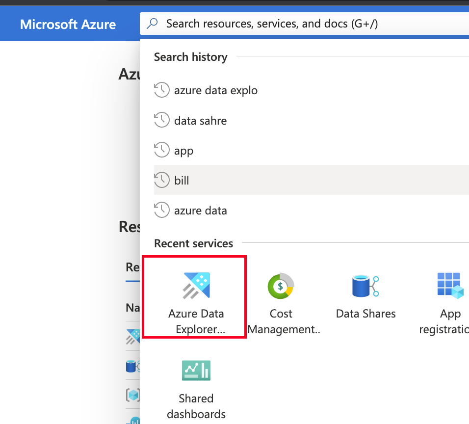
3. Create a new Azure Data explorer cluster
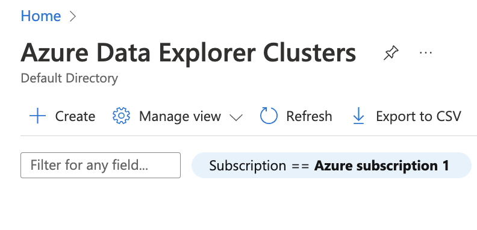


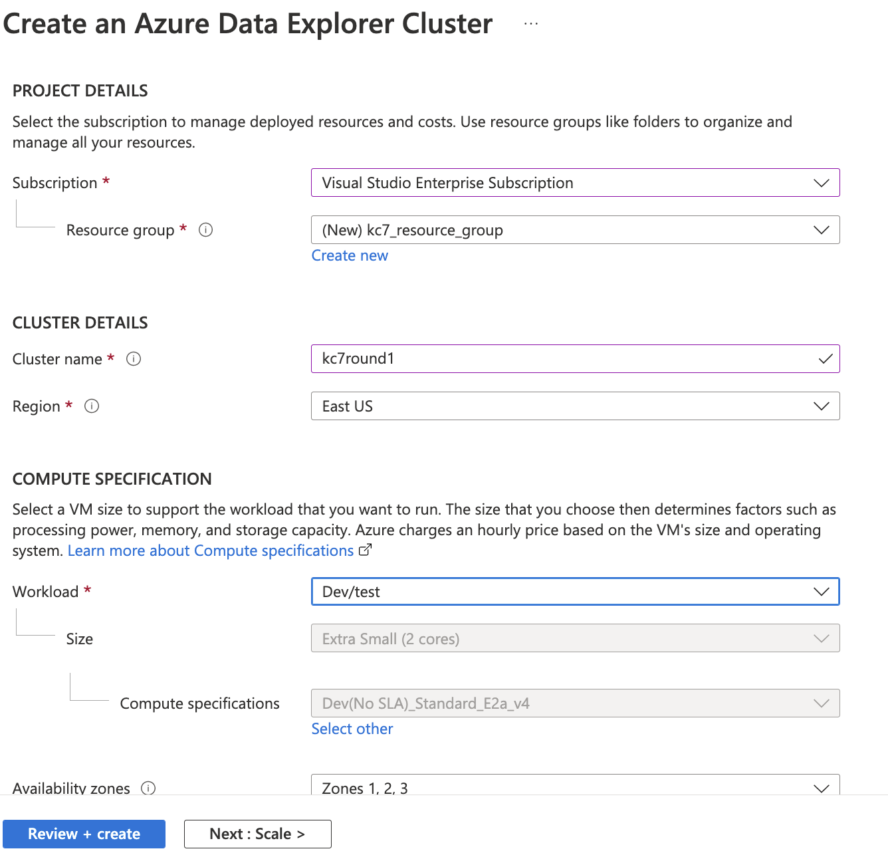
4. Add a dabase to your Cluster. Name it "SecurityLogs"
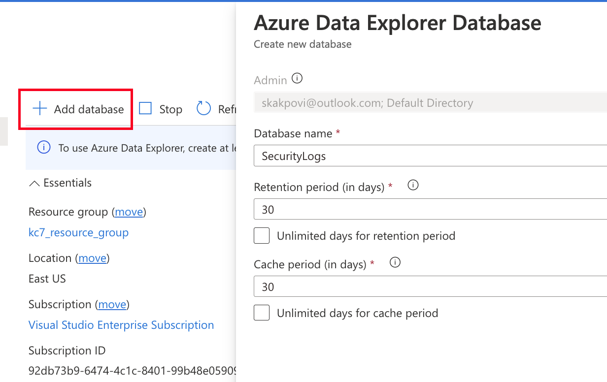


### Register an Azure Application and give it permissions to your cluster
1. Look for app registrations in the resource menu
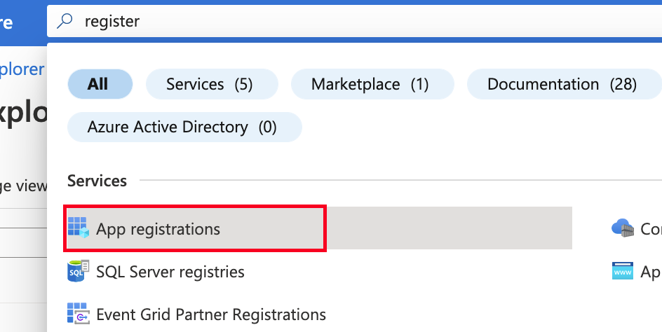
2. Register an applicaiton and give it a name. I named mine "kc7app", but you can name it anything (I would recommend giving it a meaningful name).
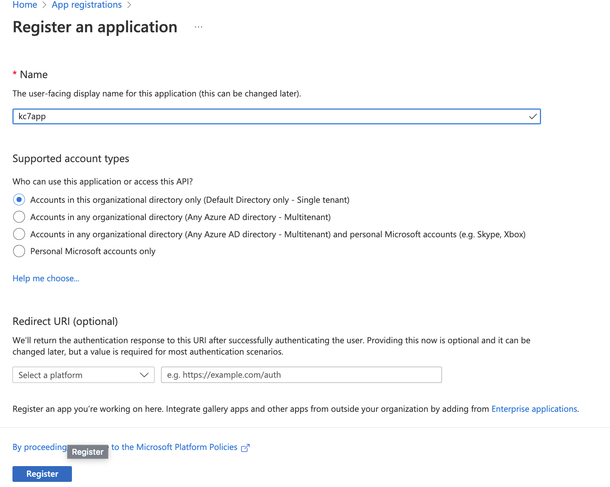

3. Give your registered app API permissions to your ADX cluster
```API Permissions > Add a permission > Azure Data explorer```
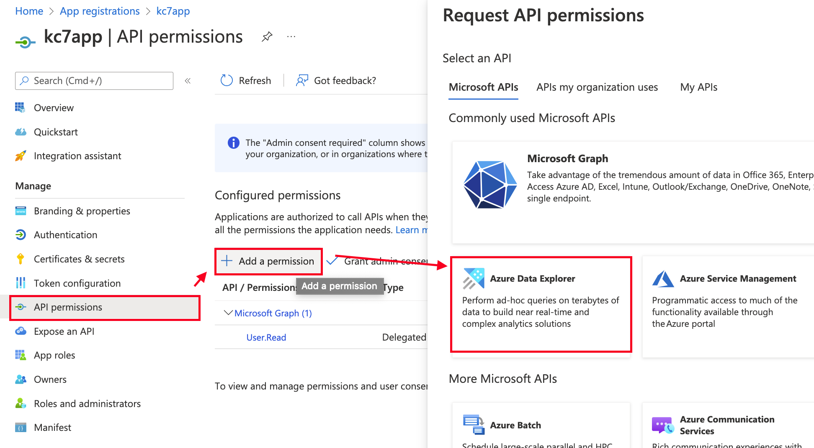

4. In the next screen add a `user_impersonation` permission
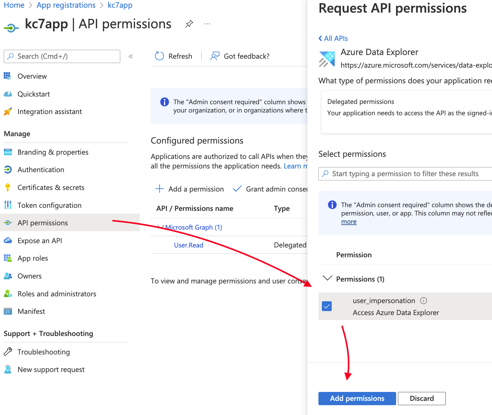

5. Generate a client secret for your application (**NOTE:** The app secret can only be viewed right after you create it. So be sure to copy it (the value) down somewhere. You will need this later).
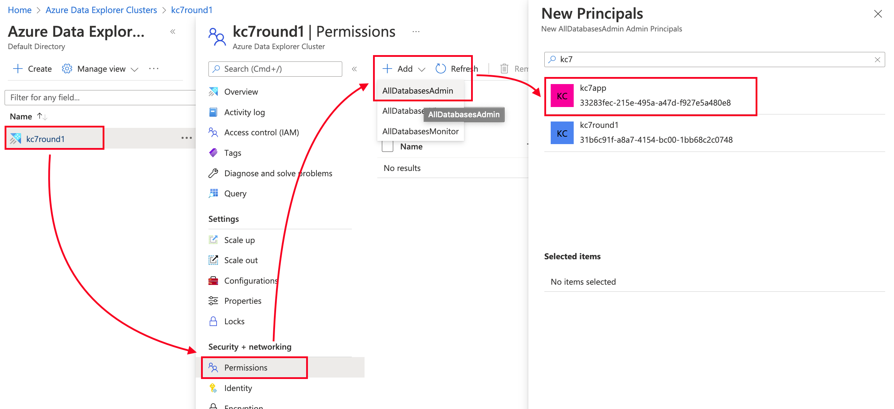
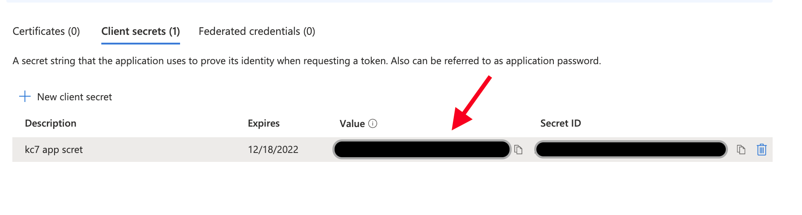

6. You will find your app client Id in the overview section of your registered app.
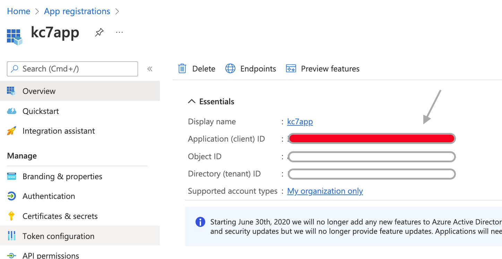


5. Go back to your ADX cluster and add your registered application as an Service admin

```Azure Data Explorer > Your ADX cluser > Permissions > Add database admin > Select your registered app name ```


### Gather your environmental variables

Next you have to fill in the required variables page in the `config.py`

```python
################################
# AZURE ENVIRONMENT VARIABLES
# FOLLOW THE README TO REPLACE THESE VALUES
################################

AAD_TENANT_ID = "{YOUR TENANT ID}" #https://docs.microsoft.com/en-us/azure/active-directory/fundamentals/active-directory-how-to-find-tenant
KUSTO_URI = "https://{clustername}.eastus.kusto.windows.net"
KUSTO_INGEST_URI =  "https://ingest-{clustername}.eastus.kusto.windows.net"
DATABASE = "SecurityLogs"

# Register an azure application and generate secrets
# give the app permission to edit your azure data explorer cluster
# App secret can only be seen right after creation
CLIENT_ID = "{YOUR REGISTERED APP CLIENT ID}" 
CLIENT_SECRET = "{YOUR RESTERED APP CLIENT SECRET}"
```

You will find your kusto url variables in the overview section of your ADX cluster.
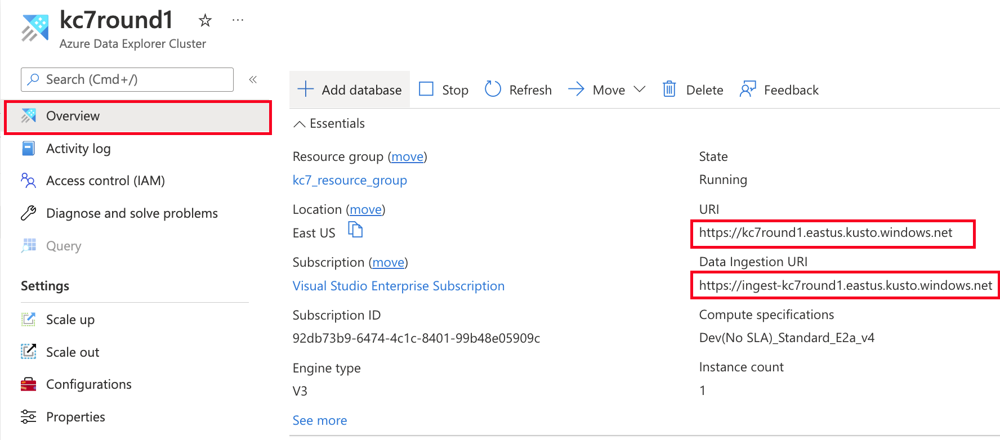


### Adding a new user the database

```
.add database SecurityLogs users ('msauser=<user@emaill.com>')
```