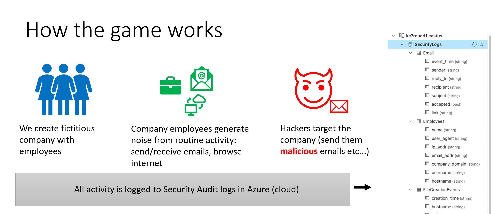
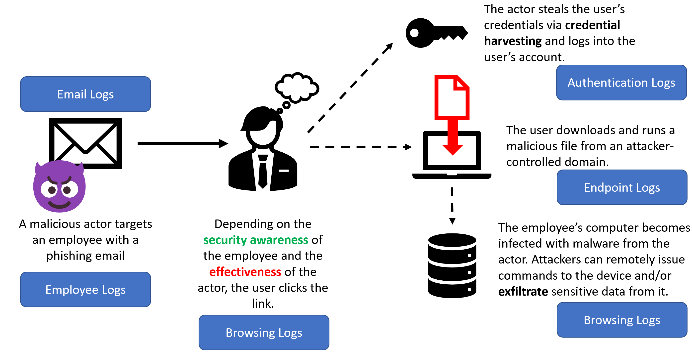
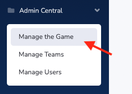
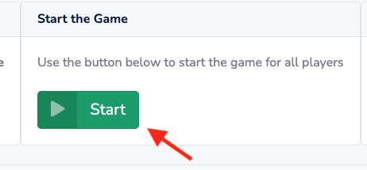

# KC7 - a cybersecurity game 

KC7 simulates an intrusion by multiple cyber threat actors against a fictitious company that spans the entire `Cyber Kill Chain`.

Players use `KQL` queries to triage logs in `Azure Data Explorer` to:
* Investigate suspicious activity in the company's environment
* Pivot on known actor indicators to uncover additional selectors and find more intrusion activity

Game players get experience triaging Web, Email, and Endpoint audit logs

### How it works 



### Here's an example scenario



## 👨🏽‍🎓 Who is this for?

* High school and college **students** who have an interest in Cybersecurity
* Anyone who wants to **reskill/change careers** into the cybersecurity field
* Cybersecurity professionals looking to **uplevel** their pivoting and analysis skills


## 🤾🏽‍♀️ Play with the data (No code required)!

Check out the instructions to set up the data in a free Kusto cluster

https://github.com/kkneomis/kc7/wiki/No-code-Required!-Loading-the-test-KC7-cluster-into-your-free-Kusto-instance

## 🏁 Getting Started with the code!
### Requirements
* [Python 3 or higher](https://www.python.org/downloads/)
* [Git Bash](https://git-scm.com/downloads)

### Installation
* Open a new bash terminal and clone the repo using the following command:

```
git clone https://github.com/kkneomis/cyber-challenger.git
```

* Install the required python packages
```
pip install -r requirements.txt
```
NOTE: After running this command some packages may require manual installation. If the command in the next step fails due to a missing package, the following command can be used to install it:

```
pip install [PACKAGE_NAME]
```

The package name may differ from the error message (for example: yaml is downloaded with the package name pyyaml)

* Run the project
```python
python app.py
```

### Running the game
* Access the Guid by browsing to your local server @ `http://127.0.0.1:5000/`

* Browsing to the Login page: `http://127.0.0.1:5000/login` and login to the adminitator account using default creds `admin:admin`

* Click on `Admin Central` in the left sidebar to get to the admin page



* Click `Start Game` to begin generating logs. The logs will be printed to your console (until you  configure your Azure secrets).



## 🤠 How to contribute

Go check out the wiki for details on how the code base is structured

## 👯 Contributors

* Simeon Kakpovi
* Greg Schloemer
* Alton Henley
* Andre Murrell
* Emily Hacker
* Matthew Kennedy
* Justin Carroll
* Syeda Sani-e-Zehra
* Stuti Kanodia
* Logo by David Hardman

