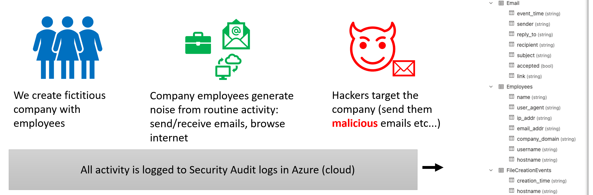

# KC7 - a cybersecurity game 

KC7 simulates an intrusion by multiple cyber threat actors against a fictitious company that spans the entire `Cyber Kill Chain`.

Players use `KQL` queries to triage logs in `Azure Data Explorer` to:
* Investigate suspicious activity in the company's environment
* Pivot on known actor indicators to uncover additional selectors and find more intrusion activity

Game players get experience triaging Web, Email, and Endpoint audit logs




## Who is this for?

* High school and college **students** who have an interest in Cybersecurity
* Anyone who wants to **reskill/change careers** into the cybersecurity field
* Cybersecurity professionals looking to **uplevel** their pivoting and analysis skills


## Getting Started


```
#Clone the repo
git clone https://github.com/kkneomis/cyber-challenger.git

#Install the required python packages
pip install -r requirements.txt

#Run the project
python3 app.py
```

Go check out the wiki for details on how the code base is structured

##  Contributors

* Simeon Kakpovi
* Greg Schloemer
* Alton Henley
* Andre Murrell

